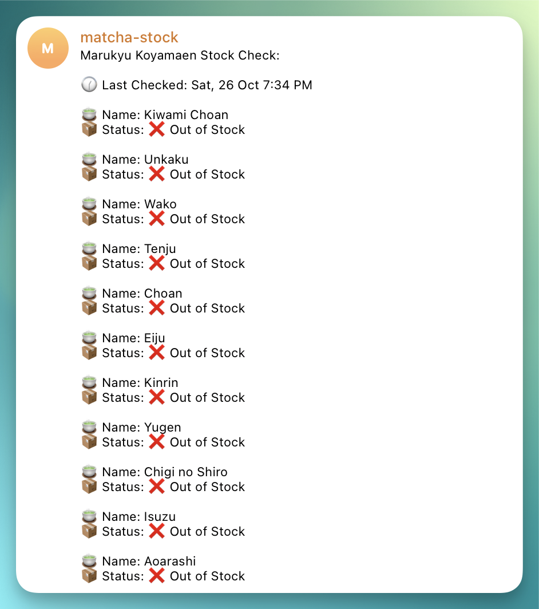

# Marukyu Koyamaen Stock Checker

This is a simple serverless application that checks the stock of Marukyu Koyamaen products.



## How It Works

1. The system uses a Go-based Lambda function to scrape the Marukyu Koyamaen website.
2. It checks the stock status of matcha products.
3. The results are formatted into a readable message.
4. This message is sent to a specified Telegram chat using a Telegram bot.
5. The process is automated to run twice daily at noon and midnight Singapore time.

## Deployment Architecture

The project is deployed on AWS with the following components:

1. **AWS Lambda**: Hosts the Go function that performs the web scraping and sends Telegram messages.
2. **Amazon CloudWatch Events**: Triggers the Lambda function on a schedule.
3. **Terraform**: Used for Infrastructure as Code (IaC) to manage and deploy AWS resources.

### AWS Services Used

1. **AWS Lambda**
    - good for intermittent work; pay per use (cost efficiency)
    - response time not critical (so cold starts not a problem)
    - I don’t need continuous server uptime (don’t need ec2)

2. **Amazon CloudWatch Events**
    - Provides a reliable way to trigger Lambda functions on a schedule.
    - Serverless and fully managed by AWS.
    - Integrates seamlessly with Lambda.

## Deployment

1. Ensure you have AWS CLI configured and Terraform installed.
2. Clone this repository.
3. From the root directory, run `make build` to build the Lambda function.
4. Navigate to the `deployment` directory.
5. Create a `terraform.tfvars` file with the following content:

    ```hcl
    <!-- terraform.tfvars file-->
    lambda_role_arn = "your-lambda-role-arn" 
    telegram_bot_token = "your-telegram-bot-token" 
    telegram_chat_id = "your-telegram-chat-id"
    ```

6. Apply the Terraform configuration:

    ```bash
    terraform init
    terraform plan
    terraform apply
    ```
